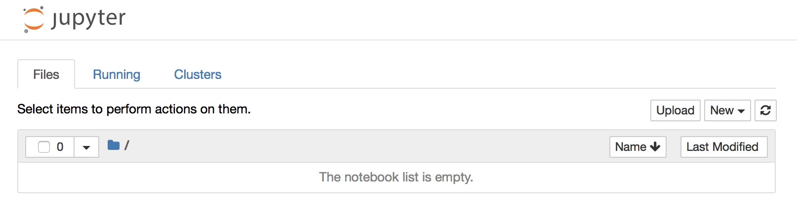
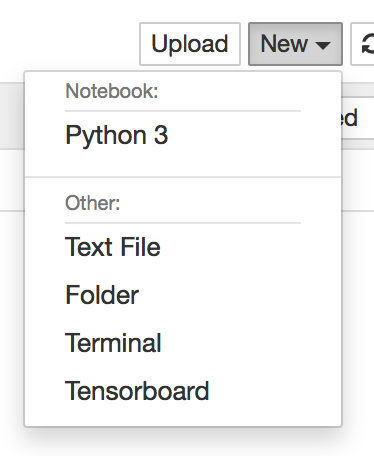
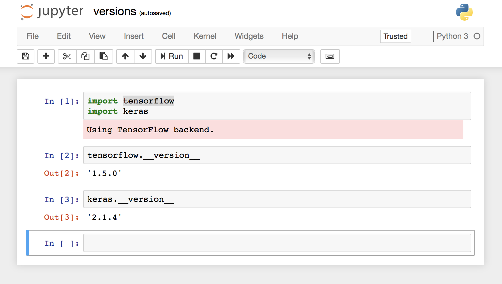
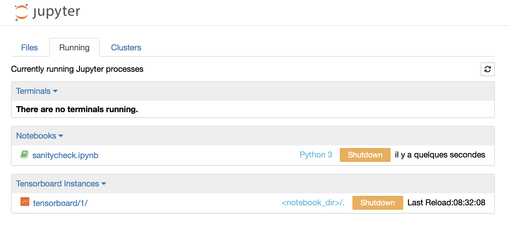

# Artificial Neural Networks

[](https://hub.docker.com/r/zifeo/artificial-neural-networks/)

Throughout the semester, we will use [Keras](https://keras.io) with the [Tensorflow](https://www.tensorflow.org) backend in pratical exercices and mini-projects. Due to the differences between platforms and for the sake of reproducability, we provide an all-in-one docker image. In case you own a [CUDA-enabled gpu](https://developer.nvidia.com/cuda-gpus) on GNU/Linux you can take advantage of the `gpu` version, otherwise the `cpu` version will do the job.

Although we do not support it, you can as well use [conda/miniconda](https://conda.io/docs/user-guide/getting-started.html) or create your own local setup with this [list of packages](https://github.com/zifeo/artificial-neural-networks/blob/master/Dockerfile.cpu#L26-L38) (e.g. using [virtualenv](https://virtualenv.pypa.io/en/stable/)). However your assignements should run fine within this image and with the same config:

- python==3.5
- Keras==2.1.4
- tensorflow==1.5.0 

## Getting started

[Docker](https://www.docker.com) provide operating-system-level virtualization, i.d. light and easy to use containers for running software in isolation. First, you will need to install Docker CE (=community edition, make sure you do not install Docker EE):

- Mac: [instructions](https://docs.docker.com/docker-for-mac/install/) or [direct download](https://download.docker.com/mac/stable/Docker.dmg)
- Ubuntu: [instructions](https://docs.docker.com/install/linux/docker-ce/ubuntu/)
- Debian: [instructions](https://docs.docker.com/install/linux/docker-ce/debian/)
- Windows 10: [instructions](https://docs.docker.com/docker-for-windows/install/) or [direct download](https://download.docker.com/win/stable/Docker%20for%20Windows%20Installer.exe)
- Windows 7 or 8: [instructions](https://docs.docker.com/toolbox/toolbox_install_windows/) or [direct download](https://download.docker.com/win/stable/DockerToolbox.exe) (legacy, try to upgrade or fallback to [this example](http://www.deeplearningitalia.com/en/installation/) if it does not work)

## CPU version

Once Docker is installed and running, open a shell (Terminal on Mac and Linux, Command Prompt on Windows) and test your setup with:

```shell
docker run --rm zifeo/artificial-neural-networks:cpu python3 -c 'import keras; print(keras.__version__)'
```

It should output:

> Using TensorFlow backend.
>
> 2.1.4

Then, you can start the notebook server and access [localhost:8888](http://localhost:8888).

```shell
# start
# Mac + GNU/Linux
docker run --rm -d --name ann -p 8888:8888 -v $(pwd):/jupyter zifeo/artificial-neural-networks:cpu 
# Windows (Command Prompt)
docker run --rm -d --name ann -p 8888:8888 -v %cd%:/jupyter zifeo/artificial-neural-networks:cpu 
# Windows (PowerShell)
docker run --rm -d --name ann -p 8888:8888 -v ${PWD}:/jupyter zifeo/artificial-neural-networks:cpu 

# stop (do not forget)
docker stop ann
```

Be careful to use the volume mount (`-v`) to a specified folder, otherwise your work will be destroyed when stopping the notebook server.

## Security notes

This image does not include any security mechanism and thus should not be used in a open environment (e.g. public server or untrusted network) without adequate protection.

## Usage

Once you access [localhost:8888](http://localhost:8888), you should see the *files* tab. If you mounted your current directory with `-v`, you may already see files in there.



You can then easily create new notebooks using the *new* menu.



And check you have the expected Keras and Tensorflow versions.



Happy coding!

# Advanced usage

The following is **not needed** to successfully achieve exercices and mini-projets but might be of interests to some of you.

### Custom workflow

The start command can be tailored to your needs.

```shell
docker run \
  --rm \ # the container will remove itself upon termination
  -d \ # the container detach itself and run in background
  --name ann \ # self-explanatory, access live logs with `docker logs ann -f`
  -p 8888:8888 \ # publish docker port to local one
  -v $(pwd):/jupyter \ # mount current directory to container folder '/jupyter', on Windows replace $(pwd) by %cd% (for Command Prompt) or ${PWD} (for PowerShell)
  zifeo/artificial-neural-networks:cpu # image to run
```

## GPU version

This flavour is slightly trickier and require [Nvidia driver and Nvidia docker engine utility](https://github.com/NVIDIA/nvidia-docker) to be installed ([instructions](https://github.com/NVIDIA/nvidia-docker/wiki/Installation-(version-2.0))).

```shell
# test
docker run --runtime=nvidia --rm zifeo/artificial-neural-networks:gpu nvidia-smi

# start ($(pwd) should be replaced by %cd% or ${PWD} on Windows)
docker run --runtime=nvidia --rm -d --name ann -p 8888:8888 -v $(pwd):/jupyter zifeo/artificial-neural-networks:gpu

# stop
docker stop ann
```

## Tensorboard

This image also includes an embedded version of [Tensorboard](https://www.tensorflow.org/programmers_guide/summaries_and_tensorboard) which can be spawn from the *new* menu. It should spawn a new board on [localhost:8888/tensorboard/1](http://localhost:8888/tensorboard/1) (for board 1) looking for logs in the current notebook directory. If nothing shows up after creating one, you can access it from the *running* tab.




